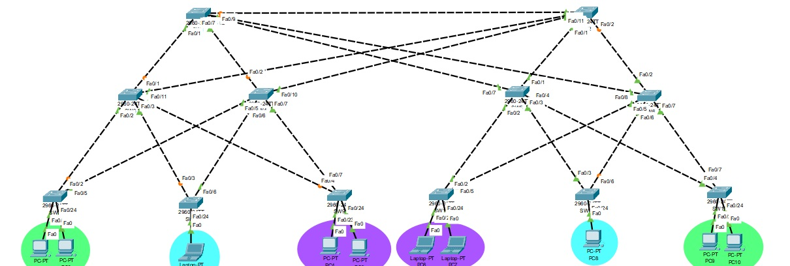

| Nombre    | Carnet   |
|-----------|----------|
|Esdras Rodolfo Toc Hi|201807373|
|Brian Josue Erazo Sagastume|201807253|
|Brayan Alexander Mejia Barrientos|201900576|


# CONFIGURACION DE LOS SWITCHES Y PCS

# SWITCH 1
```
enable
conf t
hostname SW1_G35
exit
enable
conf t
vtp mode client
vtp version 2
vtp domain g35
vtp password pass
exit
show vtp status
exit
enable
conf t
int range f0/1 - 2
switchport mode trunk
switchport trunk allowed vlan 18,28,38
exit
int range f0/7 - 9
switchport mode trunk
switchport trunk allowed vlan 18,28,38
exit
do write
do show interfaces trunk
exit
int range f0/1 - 2
switchport nonegotiate
int range f0/7 - 9
switchport nonegotiate
do write
exit
```

# SWITCH 2
```
enable
conf t
hostname SW2_G35
exit
enable
conf t
vtp mode client
vtp version 2
vtp domain g35
vtp password pass
exit
show vtp status
exit
enable
conf t
int range f0/1 - 2
switchport mode trunk
switchport trunk allowed vlan 18,28,38
exit
int range f0/9 - 11
switchport mode trunk
switchport trunk allowed vlan 18,28,38
exit
do write
do show interfaces trunk
exit
int range f0/1 - 2
switchport nonegotiate
int range f0/9 - 11
switchport nonegotiate
do write
exit
```

# SWITCH 3
```
enable
conf t
hostname SW3_G35
exit
enable
conf t
vtp mode client
vtp version 2
vtp domain g35
vtp password pass
exit
show vtp status
exit
enable
conf t
int range f0/1 - 4
switchport mode trunk
switchport trunk allowed vlan 18,28,38
exit
int f0/11
switchport mode trunk
switchport trunk allowed vlan 18,28,38
exit
do write
do show interfaces trunk
exit
int range f0/1 - 4
switchport nonegotiate
int f0/11
switchport nonegotiate
do write
exit
```

# SWITCH 4
```
enable
conf t
hostname SW4_G35
exit
enable
conf t
vtp mode client
vtp version 2
vtp domain g35
vtp password pass
exit
show vtp status
exit
enable
conf t
int f0/2
switchport mode trunk
switchport trunk allowed vlan 18,28,38
exit
int range f0/5 - 7
switchport mode trunk
switchport trunk allowed vlan 18,28,38
exit
int f0/10
switchport mode trunk
switchport trunk allowed vlan 18,28,38
exit
do write
do show interfaces trunk
exit
int range f0/5 - 7
switchport nonegotiate
int f0/2
switchport nonegotiate
int f0/10
switchport nonegotiate
do write
exit
```

# SWITCH 5
```
enable
conf t
hostname SW5_G35
exit
enable
conf t
vtp mode client
vtp version 2
vtp domain g35
vtp password pass
exit
show vtp status
exit
enable
conf t
int range f0/1 - 4
switchport mode trunk
switchport trunk allowed vlan 18,28,38
exit
int f0/7
switchport mode trunk
switchport trunk allowed vlan 18,28,38
exit
do write
do show interfaces trunk
exit
int range f0/1 - 4
switchport nonegotiate
int f0/7
switchport nonegotiate
do write
exit
```

# SWITCH 6
```
enable
conf t
hostname SW6_G35
exit
enable
conf t
vtp mode client
vtp version 2
vtp domain g35
vtp password pass
exit
show vtp status
exit
enable
conf t
int f0/2
switchport mode trunk
switchport trunk allowed vlan 18,28,38
exit
int range f0/5 - 8
switchport mode trunk
switchport trunk allowed vlan 18,28,38
exit
do write
do show interfaces trunk
exit
int f0/2
switchport nonegotiate
int range f0/5 - 8
switchport nonegotiate
do write
exit
```

# SWITCH 7
```
enable
conf t
hostname SW7_G35
exit
enable
conf t
vtp mode client
vtp version 2
vtp domain g35
vtp password pass
exit
show vtp status
exit
enable
conf t
int f0/2
switchport mode trunk
switchport trunk allowed vlan 18,28,38
exit
int f0/5
switchport mode trunk
switchport trunk allowed vlan 18,28,38
exit
do write
do show interfaces trunk
exit
enable
conf t
int range f0/23 - 24
switchport mode access
switchport access vlan 18
do write
exit
int f0/2
switchport nonegotiate
int f0/5
switchport nonegotiate
do write
exit
```

# SWITCH 8
```
enable
conf t
hostname SW8_G35
exit
enable
conf t
vtp mode client
vtp version 2
vtp domain g35
vtp password pass
exit
show vtp status
exit
enable
conf t
int f0/3
switchport mode trunk
switchport trunk allowed vlan 18,28,38
exit
int f0/6
switchport mode trunk
switchport trunk allowed vlan 18,28,38
exit
do write
do show interfaces trunk
exit
enable
conf t
int f0/24
switchport mode access
switchport access vlan 28
do write
exit
int f0/24
switchport port-security
switchport mode access
switchport port-security mac-address 0040.0B70.7964
switchport port-security violation shutdown 
switchport port-security
exit
do write
int f0/3
switchport nonegotiate
int f0/6
switchport nonegotiate
do write
exit
```

# SWITCH 9
```
enable
conf t
hostname SW9_G35
exit
enable
conf t
vtp mode client
vtp version 2
vtp domain g35
vtp password pass
exit
show vtp status
exit
enable
conf t
int f0/4
switchport mode trunk
switchport trunk allowed vlan 18,28,38
exit
int f0/7
switchport mode trunk
switchport trunk allowed vlan 18,28,38
exit
do write
do show interfaces trunk
exit
enable
conf t
int range f0/23 - 24
switchport mode access
switchport access vlan 38
do write
exit
int f0/4
switchport nonegotiate
int f0/7
switchport nonegotiate
do write
exit
```

# SWITCH 10 (SERVER)
```
enable
conf t
hostname SW10_G35
enable secret redes2grupo35
exit
enable
conf t
vtp mode server
vtp version 2
vtp domain g35
vtp password pass
exit
conf t
vlan 18
name Primaria18
vlan 28
name Secundaria28
vlan 38
name Diversificado38
exit
do write
do show vlan
exit
enable
conf t
int f0/2
switchport mode trunk
switchport trunk allowed vlan 18,28,38
exit
int f0/5
switchport mode trunk
switchport trunk allowed vlan 18,28,38
exit
do write
do show interfaces trunk
exit
enable
conf t
int range f0/23 - 24
switchport mode access
switchport access vlan 38
do write
exit
int vlan 18
ip address 192.168.18.1 255.255.255.0
exit
int vlan 28
ip address 192.168.28.1 255.255.255.0
exit
int vlan 38
ip address 192.168.38.1 255.255.255.0
exit
int f0/2
switchport nonegotiate
int f0/5
switchport nonegotiate
do write
exit
```

# SWITCH 11
```
enable
conf t
hostname SW11_G35
exit
enable
conf t
vtp mode client
vtp version 2
vtp domain g35
vtp password pass
exit
show vtp status
exit
enable
conf t
int f0/3
switchport mode trunk
switchport trunk allowed vlan 18,28,38
exit
int f0/6
switchport mode trunk
switchport trunk allowed vlan 18,28,38
exit
do write
do show interfaces trunk
exit
enable
conf t
int range f0/24
switchport mode access
switchport access vlan 28
do write
exit
int f0/24
switchport port-security
switchport mode access
switchport port-security mac-address 0002.1615.A264
switchport port-security violation shutdown 
switchport port-security
exit
do write
int f0/3
switchport nonegotiate
int f0/6
switchport nonegotiate
do write
exit
```

# SWITCH 12
```
enable
conf t
hostname SW12_G35
exit
enable
conf t
vtp mode client
vtp version 2
vtp domain g35
vtp password pass
exit
show vtp status
exit
enable
conf t
int f0/4
switchport mode trunk
switchport trunk allowed vlan 18,28,38
exit
int f0/7
switchport mode trunk
switchport trunk allowed vlan 18,28,38
exit
do write
do show interfaces trunk
exit
enable
conf t
int range f0/23 - 24
switchport mode access
switchport access vlan 18
do write
exit
int f0/4
switchport nonegotiate
int f0/7
switchport nonegotiate
do write
exit
```

write memory

## PC PRIMARIAS
192.168.18.2
192.168.18.3
192.168.18.4
192.168.18.5

## PC BASICOS
192.168.28.2
192.168.28.3

## PC DIVERSIFICADO
192.168.38.2
192.168.38.3
192.168.38.4
192.168.38.5
## Eleccion de escenario 
| Escenario | Protocolo Spannig-Tree | Red Primaria | Red Básicos | Red Diversifico |
|-----------|-----------|-----------|-----------|-----------|
| 1 | PVST | 43 s | 50 s | 50 s |
| 2 | Rapid PVST | 49 s | 33 s | 50 s |

## Nuestra propuesta final 
El protocolo PVST tiene un promedio de 47 s   
El protocolo Rapid PVST tiene un promedio de 44 s
