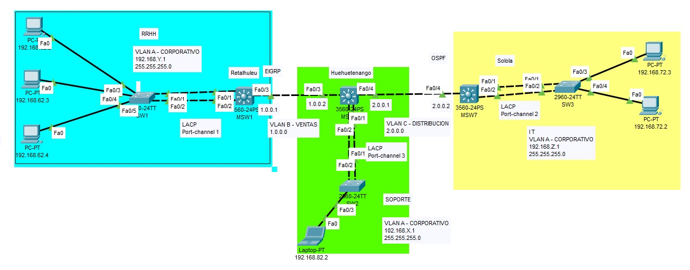

Universidad de San Carlos de Guetamala  
Facultad de Ingenieria  
Escuela de Ciencias y Sistemas  
Redes de computadoras 2  

| Nombre    | Carnet   |
| --------- | -------- |
| Esdras Toc     | 201807373 |
| Brian Erazo    | 201807253 |
| Brayan Mejia   | 201900576 |

#Tipologia

# VLANS
| VLAN | NUMERO  |
| --------- | --------- |
| VLAN A    |   68        |
| VLAN B    |     18      |
| VLAN C    |     28      |

# DIRECCION IP PC

| Departamento | Direccion IP | Mascara |
| --------- | --------- | --------- |
| CORPORATIVO    | 192.168.88.3    | 255.255.255.0    |
| CORPORATIVO    | 192.168.88.2    | 255.255.255.0    |
| SOPORTE    | 192.168.78.2    | 255.255.255.0    |
| RRHH    | 192.168.68.2    | 255.255.255.0    |
| RRHH   | 192.168.68.3    | 255.255.255.0   |
| RRHH    | 192.168.68.4    | 255.255.255.0   |

# IP DE LAS PC

! PC0
ip address 192.168.68.10
! PC1
ip address 192.168.68.20
! PC2
ip address 192.168.68.30
! PC3
ip address 192.168.88.10
! PC4
ip address 192.168.88.20
! PC5
ip address 192.168.78.10

#VLANS 

CORPORATIVO68
VENTAS18
DISTRIBUCION28

#SW0

enable
configure terminal
no ip domain lookup
hostname SW0

vlan 68
name corporativo
exit

interface range fa0/1-3
no shutdown
switchport mode access
switchport access vlan 68
exit

interface range fa0/4-5
no shutdown
channel-group 1 mode passive
exit

interface po1
switchport mode trunk
switchport trunk allowed vlan 68
exit

do write
end

#SW1

enable
configure terminal
no ip domain lookup
hostname SW1

vlan 68
name corporativo
exit

interface fa0/1
no shutdown
switchport mode access
switchport access vlan 68
exit

interface range fa0/2-3
no shutdown
channel-group 2 mode passive
exit

interface po2
switchport mode trunk
switchport trunk allowed vlan 68
exit

do write
end

#SW2

enable
configure terminal
no ip domain lookup
hostname SW2

vlan 68
name corporativo
exit

interface range fa0/1-2
no shutdown
switchport mode access
switchport access vlan 68
exit

interface range fa0/3-4
no shutdown
channel-group 3 mode passive
exit

interface po3
switchport mode trunk
switchport trunk allowed vlan 68
exit

do write
end

#MLSW0

enable
configure terminal
no ip domain lookup

vlan 68
name corporativo
vlan 18
name ventas
exit

hostname MLSW0

interface range fa0/1-2
no shutdown
channel-group 1 mode active
exit

interface po1
switchport trunk encapsulation dot1q
switchport mode trunk
switchport trunk allowed vlan 68,18
exit

interface fa0/3
no shutdown
no switchport
ip address 1.0.0.2 255.0.0.0
exit

interface vlan 68
ip address 192.168.68.1 255.255.255.0
no shutdown
exit

ip routing
router eigrp 32
network 192.168.68.0 0.0.0.255
network 1.0.0.0 0.255.255.255
exit

do write
end

#MLSW1

enable
configure terminal
no ip domain lookup

vlan 68
name corporativo
vlan 18
name ventas
vlan 28
name distribucion
exit

hostname MLSW1

interface range fa0/1-2
no shutdown
channel-group 2 mode active
exit

interface po2
switchport trunk encapsulation dot1q
switchport mode trunk
switchport trunk allowed vlan 68,18,28
exit

interface fa0/3
no shutdown
no switchport
ip address 1.0.0.1 255.0.0.0
exit

interface fa0/4
no shutdown
no switchport
ip address 2.0.0.1 255.0.0.0
exit

interface vlan 68
ip address 192.168.78.1 255.255.255.0
no shutdown
exit

ip routing
router eigrp 32
  network 192.168.78.0 0.0.0.255
  network 1.0.0.0 0.255.255.255
  network 2.0.0.0 0.255.255.255
  redistribute ospf 64 metric 1 1 1 1 1

router ospf 64
  network 192.168.78.0 0.0.0.255 area 0
  network 1.0.0.0 0.255.255.255 area 0
  network 2.0.0.0 0.255.255.255 area 0
  redistribute eigrp 32 subnets

do write
end

#MLSW2

enable
configure terminal
no ip domain lookup

vlan 68
name corporativo
vlan 28
name distribucion
exit

hostname MLSW2

interface range fa0/1-2
no shutdown
channel-group 3 mode active
exit

interface po3
switchport trunk encapsulation dot1q
switchport mode trunk
switchport trunk allowed vlan 68,28
exit

interface fa0/3
no shutdown
no switchport
ip address 2.0.0.2 255.0.0.0
exit

interface vlan 68
ip address 192.168.88.1 255.255.255.0
no shutdown
exit

ip routing
router ospf 64
network 192.168.88.0 0.0.0.255 area 0
network 2.0.0.0 0.255.255.255 area 0
exit

do write
end

